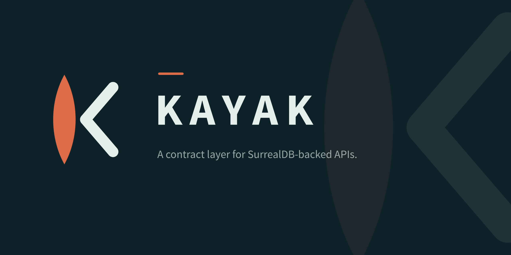
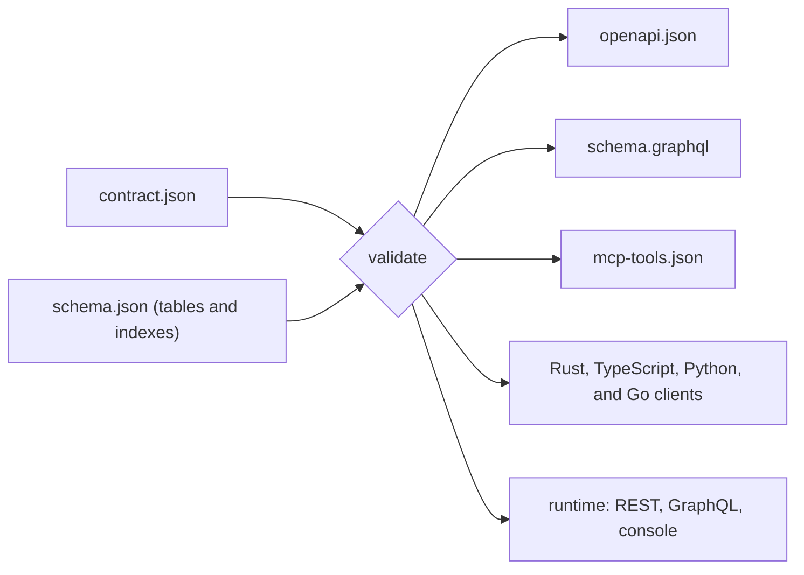

<p align="center">
  
</p>

<p align="center">
  <a href="LICENSE"></a>
  
  
</p>

Kayak keeps an API and its database in agreement. You write one short
contract that says what your API exposes: which tables, which fields,
which filters and sorts, and which actions. Kayak checks the contract
against your SurrealDB schema, indexes included, and then generates
everything that describes the API from it: an OpenAPI document, a GraphQL
schema, an MCP tool manifest for AI agents, and typed clients in Rust,
TypeScript, Python, and Go. With the runtime features turned on, it also
serves the API.

Every one of those surfaces comes from the same checked-in file, so they
can't drift apart. And because the check reads your real indexes, a
filter or sort that no index can serve is an error when you generate,
before it can reach production as a table scan.

The name comes from the job. A kayak is a small boat that holds its line
in a current, and this tool exists to stop schema drift.



Kayak is written for Rust services on SurrealDB. Its reference deployment,
a file service, uses it for its REST, GraphQL, and MCP interfaces and its
admin console.

## Install

Kayak needs Rust 1.95 or newer.

The command-line tool:

```sh
cargo install oneiriq-kayak
```

Add `--features verify` to include `kayak verify`, which checks a contract
against a live database.

The library, in your service's `Cargo.toml`:

```toml
[dependencies]
oneiriq-kayak = { version = "0.1", features = ["runtime"] }
oneiriq-surql = { version = "0.34", default-features = false }
```

The crate is `oneiriq-kayak` and you import it as `kayak`. Schema types
come from [`oneiriq-surql`](https://crates.io/crates/oneiriq-surql),
imported as `surql`.

| Feature | What it adds |
| --- | --- |
| (none) | Validation, the generators, the differ, and the scaffold. |
| `runtime` | The dispatcher that enforces the contract, your resolvers and middleware, and a REST router. |
| `graphql` | A live GraphQL schema on `async-graphql`, with subscriptions for watchable resources. Includes `runtime`. |
| `console` | A server-rendered HTML console for operators. Includes `runtime`. |
| `verify` | Checks every declared filter, sort, and search against the database's query planner. |

## Quick start

This takes a single table from schema to generated API: two small files
and one command.

**1. Describe the schema.** Kayak reads your schema as a JSON array of
surql table definitions. In a real service you write this file from the
same definitions your code already uses, with
`serde_json::to_string_pretty(&tables)`. Save this as `schema.json`:

```json
[
  {
    "name": "file",
    "fields": [
      { "name": "tenant_id", "type": "string" },
      { "name": "path", "type": "string" },
      { "name": "state", "type": "string" },
      { "name": "size_bytes", "type": "int", "nullable": true },
      { "name": "created_at", "type": "datetime" }
    ],
    "indexes": [
      { "name": "idx_listing", "columns": ["tenant_id", "state", "created_at"] }
    ]
  }
]
```

**2. Write the contract.** Save this as `contract.json`. It exposes four
columns (renaming one), scopes every read to a tenant, allows filtering by
`state` and sorting by `created_at`, and adds one action and one search
query.

```json
{
  "name": "files",
  "version": "0.1.0",
  "resources": [
    {
      "name": "files",
      "table": "file",
      "fields": [
        { "column": "path" },
        { "column": "state" },
        { "column": "size_bytes", "rename": "size" },
        { "column": "created_at" }
      ],
      "pinned": ["tenant_id"],
      "filterable": ["state"],
      "sortable": ["created_at"],
      "actions": [
        {
          "name": "issue_url",
          "method": "POST",
          "path": "/{id}/url",
          "input": [{ "name": "ttl_secs", "kind": "int" }],
          "output": "json"
        }
      ]
    }
  ],
  "queries": [
    {
      "name": "search",
      "path": "/v1/search",
      "input": [
        { "name": "q", "kind": "string", "required": true },
        { "name": "limit", "kind": "int" }
      ]
    }
  ]
}
```

**3. Generate.**

```sh
kayak generate --contract contract.json --schema schema.json --out generated
```

```text
wrote generated/client.go
wrote generated/client.py
wrote generated/client.rs
wrote generated/client.ts
wrote generated/mcp-tools.json
wrote generated/openapi.json
wrote generated/schema.graphql
```

The API has `GET /v1/files`, `GET /v1/files/{id}`,
`POST /v1/files/{id}/url`, and `GET /v1/search`, and every file above
describes exactly those.

### When the contract and the database disagree

Try sorting by a column that no index can serve. Change `sortable` to
`["created_at", "path"]` and generate again:

```text
contract failed validation:
  - resource files: sortable column path is not reachable as an index sort suffix on file; some index must hold it with every earlier column pinned or filterable, or ORDER BY falls off the index
```

The command exits with status 1, writes nothing, and names the column.
Fix it by adding an index that ends in `path`, or by dropping the sort.

### Catching breaking changes

Keep the previous contract and compare it with the new one. `kayak diff`
prints each change that matters to clients, marked `BREAKING` or
`compatible`, and exits with status 1 if any change is breaking. That
makes it a good CI check. If you remove the `state` filter:

```sh
kayak diff contract.v1.json contract.json
```

```text
BREAKING   files: filter state removed
```

Additions are reported too, marked `compatible`, and they leave the exit
status at 0. Compare the same two files in the other order, so the
`state` filter is being added:

```sh
kayak diff contract.json contract.v1.json
```

```text
compatible files: filter state added
```

With no reportable changes, the output is `no contract changes` and the
exit status is 0.

The differ compares contracts, so it catches changes a document diff
misses: a filter that disappeared, an input that became required, or a
field that now reads from a different column under the same name.

### Starting from an existing database

`kayak scaffold` reads a schema and writes a contract that already
validates against it:

```sh
kayak scaffold --schema schema.json --out scaffolded.json --name files --pinned tenant_id
```

```text
wrote scaffolded.json
1 resources, 2 filters and 1 sorts derived from indexes; narrow to what the API should offer before generating
```

The scaffold is conservative on purpose, because removing something from a
contract later is a breaking change and adding it is not.

- It adds no actions. Actions are behavior, and behavior lives in your
  service.
- It leaves columns whose names suggest secrets (such as `key_hash`)
  unexposed, and lists them on stderr.
- It skips tables whose pinned columns don't lead any index, since every
  read of such a table would scan it, and lists those too.
- It only claims a sort when the pinned columns cover the whole index
  prefix ahead of it.

Review the result, narrow it to what the API should offer, and add your
actions.

## Serve the contract

With the `runtime` feature, the contract runs. You register a resolver for
each operation, which is where your own database code goes. The
dispatcher checks every request against the contract before your code
runs: it clamps page sizes, accepts only declared filters and sorts, and
validates inputs. If the contract declares an operation you haven't
registered, building the dispatcher fails and names it.

```rust
use std::sync::Arc;

use kayak::runtime::{Dispatcher, KayakContext, ListOutput, Resolvers, RestRouter};
use kayak::Contract;
use serde_json::json;
use surql::schema::TableDefinition;

#[tokio::main]
async fn main() -> Result<(), Box<dyn std::error::Error>> {
    let contract: Contract = serde_json::from_str(&std::fs::read_to_string("contract.json")?)?;
    let schema: Vec<TableDefinition> =
        serde_json::from_str(&std::fs::read_to_string("schema.json")?)?;

    // Refuse to start if the contract no longer matches the database.
    let violations = kayak::validate(&contract, &schema);
    assert!(violations.is_empty(), "{violations:?}");

    let resolvers = Resolvers::new()
        .list("files", |_ctx, args| async move {
            // Query your database here. `args.limit` is already clamped and
            // `args.filters` holds only declared, indexed filters.
            println!("list files: {args:?}");
            Ok(ListOutput {
                items: vec![json!({
                    "id": "f1", "path": "a.txt", "state": "ready",
                    "size": 3, "created_at": "2026-01-01T00:00:00Z"
                })],
                next_cursor: None,
            })
        })
        .get("files", |_ctx, args| async move {
            Ok(Some(json!({ "id": args.id, "path": "a.txt", "state": "ready" })))
        })
        .action("files", "issue_url", |_ctx, args| async move {
            let id = args.id.unwrap_or_default();
            Ok(Some(json!({ "url": format!("https://cdn.example.com/{id}") })))
        })
        .query("search", |_ctx, args| async move {
            Ok(json!({ "query": args.input.get("q"), "items": [] }))
        });

    let dispatcher = Arc::new(Dispatcher::new(Arc::new(contract), resolvers, vec![])?);
    let rest = RestRouter::new(dispatcher.clone());

    // Map your HTTP framework's requests onto `handle`.
    let answer = rest
        .handle("GET", "/v1/files", "limit=5000&state=ready", None, KayakContext::new())
        .await;
    println!("{} {}", answer.status, answer.body);
    Ok(())
}
```

`RestRouter` has no HTTP server of its own. It turns a method, path, query
string, and body into a status and a JSON body, so it fits behind axum,
actix, or anything else. Middleware (authentication, tenancy, logging)
wraps every operation through the third argument to `Dispatcher::new`.

With the `graphql` feature, `kayak::runtime::graphql::build_schema(&schema,
dispatcher)` returns an `async-graphql` schema that dispatches through the
same resolvers and middleware. With `console`, `ConsoleRouter` renders an
HTML console for the same resources. The [runtime guide](docs/runtime.md)
covers middleware, scopes, guards, rate limits, subscriptions, and the
console.

## Command reference

| Command | What it does |
| --- | --- |
| `kayak generate --contract <file-or-dir> --schema <file> --out <dir> [--targets <list>]` | Validates the contract and writes the artifacts. |
| `kayak diff <old> <new>` | Lists changes between two contracts. Exits 1 if any change is breaking. |
| `kayak scaffold --schema <file> [--out <file>] [--name <name>] [--version <v>] [--pinned <cols>]` | Writes a starting contract from a schema. |
| `kayak verify --contract <file-or-dir> --db <ws-url> --namespace <ns> --database <db> [--user <u> --pass <p>]` | Asks a live SurrealDB to plan every declared filter, sort, and search, and exits 1 if any would scan. Needs the `verify` feature. |

`--targets` takes a comma-separated list. The default is
`openapi,sdl,mcp,client-rs,client-ts,client-py,client-go`. Two more
targets are available on request: `client-rs-blocking` (a blocking Rust
client) and `engine-policy` (database permissions derived from the
contract).

A contract can be one JSON file or a directory holding `contract.json`
plus one file per resource in `resources/` and per query in `queries/`.
Flags take their value as the next argument (`--out generated`).

## Documentation

| Guide | What it covers |
| --- | --- |
| [Contract reference](docs/contract.md) | Every field in a contract, the validation rules, and what the differ calls breaking. |
| [Generators](docs/generators.md) | What each target produces and what the generated clients depend on. |
| [Runtime](docs/runtime.md) | Resolvers, middleware, scopes, guards, rate limits, GraphQL, REST, and the console. |

Start with [docs/README.md](docs/README.md) for the full index.

## Development

```sh
cargo test                  # default features: validation, generators, differ, CLI
cargo test --all-features   # adds the runtime, GraphQL, console, and verify tests
```

CI runs both. The `verify` tests use an embedded in-memory SurrealDB, so
the suite needs no database server.

Each generator has golden files in `tests/golden/`. When you change a
generator on purpose, re-bless the files it produces and review the diff:

```sh
KAYAK_BLESS=client-go cargo test    # one artifact
KAYAK_BLESS=all cargo test          # every artifact
```

An unknown name fails the run, so a typo can't pass as a clean bless. See
[CONTRIBUTING.md](CONTRIBUTING.md) for the rest of the workflow.

## License

Kayak is licensed under the [Apache License 2.0](LICENSE).
