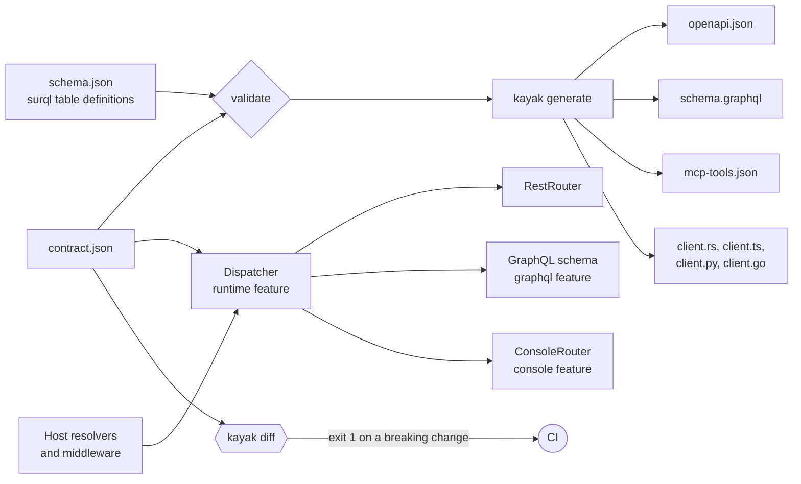

# Kayak documentation

Kayak is a contract layer for SurrealDB-backed APIs. You check in a
contract: a JSON document that says which tables and columns an API
exposes and what callers may filter, sort, and invoke. Kayak validates it
against the `surql` table definitions behind the service, including index
coverage for every filter and sort claim, and compiles it into an
OpenAPI 3.1 document, a GraphQL SDL, an MCP tool manifest, and Rust,
TypeScript, Python, and Go clients. A differ classifies each contract
change as breaking or compatible. Optional cargo features add a runtime
that serves the contract over REST, GraphQL, and an HTML console, and a
check that asks a live database whether its planner uses the indexes the
contract relies on.

Installation, the crate name, and the feature flags are covered in the
repository's root [README](../README.md).

## Reading order

Read the pages in this order. Each one assumes the one before it.

| Page | Covers | Read it when |
| --- | --- | --- |
| [contract.md](contract.md) | Every contract key and its default, the index rules for pins, filters, and sorts, identity, faces, actions, sub-resources, queries and search backings, guards, scopes, rate classes, limits, validation, `verify`, and the full diff rules. | You are writing or reviewing a contract. |
| [generators.md](generators.md) | The CLI (`scaffold`, `generate`, `diff`, `verify`), directory contracts, the schema file, each generated artifact in detail, client method naming and dependencies, the engine policy, and keeping checked-in artifacts in sync. | You are producing artifacts or wiring Kayak into CI. |
| [runtime.md](runtime.md) | Resolvers, the dispatcher's checks and their order, middleware, context and principal, guards, rate limiting, subscriptions, errors, the REST router, the live GraphQL schema, the console, and the runtime's known limitations. | You are serving a contract from a Rust service. |

## How the pieces fit

The generated artifacts are checked in and compared byte for byte in the
service's tests, so a contract edit that changes a client shows up as a
diff to review (see
[generators.md](generators.md#keeping-artifacts-in-sync)).

The runtime reads the contract when the dispatcher is built. It enforces
scopes, filter and sort allowlists, input types, rate classes, and field
guards on every face. It does not yet honor `faces`, `api_prefix`, or
`identity`, so a contract that sets them serves routes and a GraphQL
schema that differ from the generated artifacts (see
[runtime.md](runtime.md#known-limitations)).

## Why it exists

API surfaces drift away from the database schema and from their own
documentation. The contract references tables and columns by name, and
generation fails when the schema disagrees. Every artifact derives from
the same contract, and the checked-in copies are compared in tests. The
differ compares contracts directly and turns the question of whether a
deploy breaks a client into a CI exit code.

The index rules carry the operational lesson behind the library: a filter
or sort that no index serves returns correct results on small data and
scans the whole table in production. Kayak refuses it at build time and
names the column. `kayak verify` goes one step further and asks a live
database's planner.
