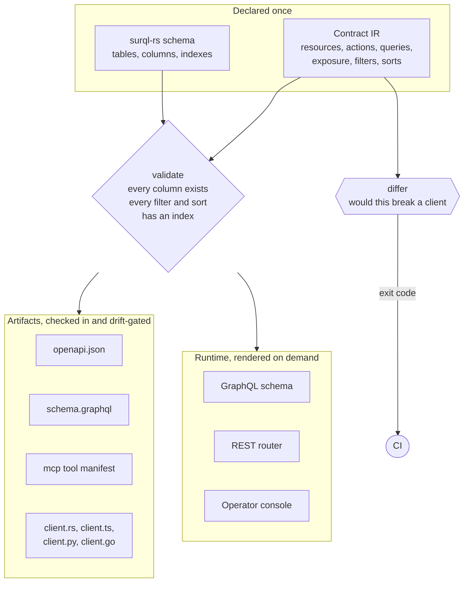

# Janus documentation

Janus is the contract layer for SurrealDB-backed APIs. A serializable
contract describes what an API exposes over which tables. Validation
resolves it against the real `surql-rs` schema definitions, including index
coverage for every filter and sort claim. From that one object come the
OpenAPI document, the GraphQL SDL, four typed clients, a breaking-change
differ, and a runtime that serves the contract live over GraphQL,
REST, and an operator console.

| Document | Covers |
| --- | --- |
| [contract.md](contract.md) | The IR: resources, exposure, pinned and filterable and sortable columns, actions, GraphQL overrides, validation rules, live-planner verification, diffing. |
| [runtime.md](runtime.md) | Resolvers, middleware, the dispatcher's enforcement, the dynamic GraphQL schema, the plugin seam. |
| [generators.md](generators.md) | The artifact faces, engine policy derivation, library and CLI use, schemas as data, the golden workflow. |

## The shape of it

One contract declaration, resolved against the schema that backs it,
becomes two things: artifacts that ship, and a runtime that serves. A
host writes resolvers and mounts faces; it never writes a route table,
a schema document, or a client.

Artifacts are compared byte for byte in the host's test suite, so a
declaration edit that changes a client shows up as a diff to bless. The
live faces need no such gate: they read the contract at run time, so
they cannot lag it.

## The premise

API surfaces drift away from the database schema and away from their own
documentation. Janus removes the room to drift. The contract references
tables and columns by name and fails generation when the schema disagrees.
Every artifact and the served GraphQL schema derive from the same object,
so they agree by construction. The differ compares contracts at
the IR level and turns "would this deploy break a client" into a CI exit
code.

The index rules carry the operational lesson behind the library: a filter or
sort that no index serves ships fine and becomes a table scan in production.
Janus refuses it at build time, naming the column.
