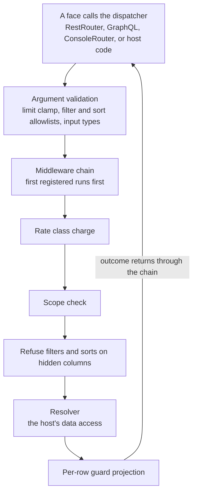

# The runtime

The generators turn a contract into files. The runtime serves it. A
service registers resolvers (its own data access), stacks middleware
around them, and builds a `Dispatcher`. The dispatcher checks every call
against the contract before a resolver runs: page limits, filter and sort
allowlists, input types, scopes, rate budgets, and field guards. Three
faces sit on top of the dispatcher and route requests into it: a REST
router, a live GraphQL schema, and an HTML operator console.

Read [contract.md](contract.md) first. The runtime enforces what the
contract declares, with some exceptions listed under
[Known limitations](#known-limitations).

| Cargo feature | Adds | Extra dependencies |
| --- | --- | --- |
| `runtime` | `Dispatcher`, `Resolvers`, middleware, guards, rate limiting, `RestRouter` | none |
| `graphql` | the live GraphQL schema; implies `runtime` | `async-graphql` 7 |
| `console` | the HTML console; implies `runtime` | `maud` |

The `verify` feature is separate and covered in
[contract.md](contract.md#verifying-against-a-live-planner).

## Quick start

This serves the first contract from [contract.md](contract.md) over the
REST router. The dispatcher refuses to build until every declared
operation has a resolver, so a contract with actions, sub-resources,
queries, or watchable resources needs those resolvers too.

```toml
[dependencies]
oneiriq-kayak = { version = "0.1", features = ["runtime"] }
serde_json = "1"
tokio = { version = "1", features = ["macros", "rt-multi-thread"] }
```

```rust
use std::sync::Arc;

use kayak::runtime::{Dispatcher, KayakContext, ListOutput, Resolvers, RestRouter};
use serde_json::json;

#[tokio::main]
async fn main() -> Result<(), Box<dyn std::error::Error>> {
    let text = std::fs::read_to_string("api/contract.json")?;
    let contract: kayak::Contract = serde_json::from_str(&text)?;

    let resolvers = Resolvers::new()
        .list("files", |_ctx, args| async move {
            // args.limit is clamped to max_page_size, and args.filters and
            // args.sort hold only declared columns.
            let rows = vec![json!({ "id": "01A", "path": "a.txt", "state": "ready" })];
            Ok(ListOutput {
                items: rows.into_iter().take(args.limit as usize).collect(),
                next_cursor: None,
            })
        })
        .get("files", |_ctx, args| async move {
            Ok((args.id == "01A").then(|| json!({ "id": "01A", "path": "a.txt", "state": "ready" })))
        });

    let dispatcher = Arc::new(Dispatcher::new(Arc::new(contract), resolvers, Vec::new())?);
    let rest = RestRouter::new(dispatcher.clone());

    let answer = rest
        .handle("GET", "/v1/files", "state=ready&limit=10", None, KayakContext::new())
        .await;
    println!("{} {}", answer.status, answer.body);
    Ok(())
}
```

Rows travel as `serde_json::Value` in wire shape: keyed by the fields' API
names, plus the identity field. Kayak never talks to a database. What a
resolver calls is the service's business.

## The request path

Every face calls the same dispatcher methods, so a GraphQL caller, a REST
caller, an operator in the console, and host code are all checked by the
same code in the same order.



Argument validation runs before the middleware chain, so middleware never
sees a call the contract refuses outright. The rate charge, scope check,
and guard checks run after the chain, so identity resolved by a
middleware counts. For a subscription, the dispatcher also takes a watch
slot before the resolver runs.

## Resolvers

A resolver is an async closure registered by name:

| Registration | Called for | Receives | Returns |
| --- | --- | --- | --- |
| `.list(resource, f)` | a listing | `ListArgs { limit, cursor, filters, sort }` | `ListOutput { items, next_cursor }` |
| `.get(resource, f)` | one instance | `GetArgs { id }` | `Option<Value>`; `None` means not found |
| `.sub_list(resource, sub, f)` | a sub-collection | `SubListArgs { parent_id, limit, cursor, filters, sort }` | `ListOutput` |
| `.action(resource, action, f)` | an action | `ActionArgs { id, input }` | `Option<Value>` |
| `.query(name, f)` | a query | `QueryArgs { input }` | `Value` |
| `.watch(resource, f)` | a subscription opening | `WatchArgs { filters }` | `RowStream` |

Every closure takes a `KayakContext` first and returns a future of
`Result<_, KayakError>`. `filters` is a map keyed by column name, and
`sort` is `Option<(String, SortDirection)>` naming a column. An action
resolver returns `Some(row)` for `"resource"` output, `Some(value)` for
`"json"`, and `None` for `"none"`.

```rust
use kayak::runtime::{KayakContext, ListOutput, Resolvers};

let resolvers = Resolvers::new()
    .list("files", |ctx: KayakContext, args| async move {
        Ok(ListOutput { items: vec![], next_cursor: None })
    })
    .get("files", |ctx, args| async move { Ok(None) })
    .action("files", "issue_url", |ctx, args| async move {
        // args.id is Some because the path holds {id}; args.input holds
        // only declared, type-checked inputs.
        Ok(Some(serde_json::json!({ "url": "https://cdn.example/01A" })))
    })
    .sub_list("files", "versions", |ctx, args| async move {
        // args.parent_id is the file; limit, filters, and sort were checked
        // against the sub-resource's own declarations.
        Ok(ListOutput { items: vec![], next_cursor: None })
    });
```

Construction is the completeness gate. `Dispatcher::new` returns a
`RuntimeBuildError` naming the first gap it finds:

- a resource without a list resolver when it has a listing, or without a
  get resolver when it has a getter (a face the resource's `faces`
  withhold needs no resolver);
- a sub-resource, action, or query without a resolver;
- a watchable resource without a watch resolver, or a watch resolver for
  a resource that is not watchable;
- a query resolver the contract does not declare;
- a rate class named anywhere without a rate store;
- a guard named in the contract that is not registered, or a registered
  guard no field names.

### Calling the dispatcher directly

Host code can call the dispatcher without a face:

| Method | Returns |
| --- | --- |
| `list(resource, ctx, ListArgs)` | `Result<ListOutput, KayakError>` |
| `get(resource, ctx, GetArgs)` | `Result<Option<Value>, KayakError>` |
| `sub_list(resource, sub, ctx, SubListArgs)` | `Result<ListOutput, KayakError>` |
| `action(resource, action, ctx, ActionArgs)` | `Result<Option<Value>, KayakError>` |
| `query(name, ctx, QueryArgs)` | `Result<Value, KayakError>` |
| `watch(resource, ctx, WatchArgs)` | `Result<RowStream, KayakError>` |
| `contract()` | the `Arc<Contract>` it enforces |

`ListArgs`, `SubListArgs`, `ActionArgs`, `QueryArgs`, and `WatchArgs`
implement `Default`. Set `limit` explicitly: the default of 0 clamps to 1.

## Argument validation

Before the middleware chain, the dispatcher checks the call against the
declaration and answers `bad_request` on any failure:

- The resource, action, sub-resource, or query must exist.
- Faces: a listing of a resource whose `faces` withhold its listing, or a
  get on one that withholds its getter, is refused.
- Listings and sub-collection listings: `limit` is clamped to between 1
  and `max_page_size`. Every filter key must be a `filterable` column and
  the sort column must be `sortable`. When the column has
  `filter_options`, a string filter value must be one of them. A
  sub-collection listing needs a non-empty `parent_id`.
- Actions: an action whose path holds `{id}` needs an id. Required inputs
  must be present and not null. Each input must match its `kind` (`int`
  accepts any JSON integer, `json` accepts anything). A string input with
  `options` must be one of them. Input keys the action does not declare
  are dropped without an error.
- Queries: the same input checks, except that an input key the query does
  not declare is refused with `no input named ...`.
- Subscriptions: the resource must be `watchable`, every filter key must
  be `filterable`, and a value for a column with `filter_options` must be
  one of them.

An input marked `multiple` takes several of its `options`. The OpenAPI
document and the MCP manifest publish it as an array, and the dispatcher
takes each form a caller sends: a JSON array in an action body or an MCP
call, the key repeated in a REST query string (`?facets=a&facets=b`), or
one comma-separated string (`?facets=a,b`), which the GraphQL schema and
the generated clients send. Every value must be one of the options. The
resolver reads one comma-separated string whichever form arrived, so
`args.input["facets"]` is `"a,b"` for each of those requests.

Action inputs and query inputs differ on unknown keys because the differ
calls removing an action input compatible. That holds only if an old
client that still sends the input keeps working, so the dispatcher drops
unknown action inputs. Removing a query input is breaking, and queries
refuse unknown inputs.

## Middleware

Middleware wraps every dispatched operation. A layer can refuse (return
an error), enrich the context before calling `next.run`, observe, or
change the outcome on the way back.

```rust
use std::sync::Arc;

use kayak::runtime::{
    BoxFuture, Dispatcher, KayakContext, KayakError, Middleware, Next, Operation, Outcome,
    Payload,
};

struct Tenant(String);

struct RequireTenant;

impl Middleware for RequireTenant {
    fn handle<'a>(
        &'a self,
        operation: Operation,
        ctx: KayakContext,
        payload: Payload,
        next: Next,
    ) -> BoxFuture<'a, Result<Outcome, KayakError>> {
        Box::pin(async move {
            if ctx.get::<Tenant>().is_none() {
                return Err(KayakError::Unauthorized("no tenant".into()));
            }
            next.run(operation, ctx, payload).await
        })
    }
}

let dispatcher = Dispatcher::new(
    Arc::new(contract),
    resolvers,
    vec![Arc::new(RequireTenant) as Arc<dyn Middleware>],
)?;
```

`Operation` names the resource (or the query), the `OperationKind` (`List`,
`Get`, `Action`, `SubList`, `Watch`, `Query`), and the action or
sub-resource name where one applies. `Payload` holds the validated
arguments. The first registered layer is the outermost: it runs first on
the way in and last on the way out.

## Context and principal

`KayakContext` is a typed map, one value per type. The protocol layer
seeds it per request, middleware may add to it, and resolvers read it.
Clones share values, so cloning is cheap.

```rust
use kayak::runtime::{KayakContext, Principal};

let ctx = KayakContext::new()
    .with(Tenant("acme".into()))
    .with(Principal::new("key-01", ["files_read".to_owned()]));

let tenant: Option<&Tenant> = ctx.get::<Tenant>();
```

`insert(value)` does the same as `with` on a `&mut` context. A face that
receives no context uses an empty one, so a middleware that requires a
value refuses.

A `Principal` says who is calling (`subject`) and which scopes it holds
(`scopes`, checked with `has`). The dispatcher reads it for scope checks,
rate buckets, and watch ceilings. Seed it in the protocol layer or in an
auth middleware.

## Scopes

The dispatcher checks declared scopes after the middleware chain and
before the resolver:

| Operation | Scopes checked |
| --- | --- |
| list, get, sub-collection list, subscription | the resource's `reads_require` |
| action | the action's `requires` |
| query | the query's `requires` |

With nothing declared, nothing is checked. With scopes declared and no
`Principal` in the context, the call is refused `unauthorized`. A
principal missing a scope is refused `forbidden`, naming the scope.

## Field guards

A guard decides, per caller and per row, whether a guarded field is
visible. Register one for each guard name the contract uses:

```rust
use std::sync::Arc;

use kayak::runtime::{Dispatcher, Guards, KayakContext, Principal};
use serde_json::Value;

let guards = Guards::new()
    .guard("audit_only", |ctx: &KayakContext, _row: Option<&Value>| {
        ctx.get::<Principal>().is_some_and(|p| p.has("audit"))
    })
    .guard("owner_or_admin", |ctx, row| {
        let Some(principal) = ctx.get::<Principal>() else {
            return false;
        };
        if principal.has("admin") {
            return true;
        }
        // row is None when the dispatcher asks before any row exists.
        row.and_then(|r| r.get("created_by"))
            .and_then(|v| v.as_str())
            .is_some_and(|owner| owner == principal.subject)
    });

let dispatcher = Dispatcher::with_policies(
    Arc::new(contract),
    resolvers,
    Vec::new(), // middleware
    None,       // no rate store
    guards,
)?;
```

Register only the guard names the contract uses. The closure receives the
context and the row, and returns `true` to show the field. The dispatcher
calls it at two moments:

- Before the resolver, with `row` set to `None`. A field the caller cannot
  see in that rowless form cannot be filtered or sorted on; the call is
  refused `forbidden`. A guard that depends on row values should answer
  the rowless form with whether the caller can see every row.
- After the resolver, once per field per row, with `row` set to that row.
  Denied fields are removed from the row. This applies to list, get,
  sub-collection, and subscription rows, and to actions whose output is
  `"resource"`. Query answers are not projected.

Guards are synchronous and run for every row, so they must not do IO.
Resolve anything that needs IO once in a middleware and put it in the
context, where the guard can read it.

The gate runs in both directions: a guard the contract names that is not
registered refuses to build, and so does a registered guard that no field
names.

A face you write yourself can apply the same projection:

```rust
use kayak::runtime::{guarded_fields, hidden_fields, strip_guarded};

// Per-row projection, as the dispatcher applies after a resolver.
let guarded = guarded_fields(&contract, "files", None, &guards);
for row in &mut rows {
    strip_guarded(row, &guarded, &ctx);
}

// The rowless decision, as the dispatcher uses to refuse filters and sorts.
let hidden = hidden_fields(&contract, "files", None, &guards, &ctx);
let may_filter_on_created_by = !hidden.iter().any(|field| field.column == "created_by");
```

Pass `Some("versions")` as the third argument for a sub-resource.
`strip_hidden(row, &hidden)` removes every field the rowless decision
hides.

## Rate limiting

A contract that names a rate class needs a ledger:

```rust
use std::sync::Arc;

use kayak::runtime::{Dispatcher, MemoryRateStore};

let dispatcher = Dispatcher::with_rate_store(
    Arc::new(contract),
    resolvers,
    Vec::new(), // middleware
    Arc::new(MemoryRateStore::new()),
)?;
```

`Dispatcher::with_policies` takes a store and guards together. The ledger
is charged after the middleware chain and before the scope check, so a
caller past its budget learns nothing else about the request. A listing
costs its clamped `limit` and every other operation costs one. Buckets are
keyed by rate class and principal subject; callers without a principal
share one bucket. An exhausted budget refuses with `too_many_requests`.

`MemoryRateStore` meters one process over fixed one-minute windows, which
can admit up to twice the budget across a window boundary. A deployment
with several processes implements `RateStore` over a shared store. Its
`charge(bucket, units, per_minute)` returns whether the charge fits, and
must not record units for a refused charge.

## Watching

A watchable resource needs a watch resolver. It is awaited once, when a
subscription opens, and returns a stream of rows that runs until the
subscriber drops it:

```rust
use kayak::runtime::RowStream;

let resolvers = resolvers.watch("events", |ctx, args| async move {
    // args.filters holds only filterable columns. my_live_query is your
    // own function returning a Stream of Result<Value, KayakError>.
    Ok(Box::pin(my_live_query(ctx, args)) as RowStream)
});
```

`RowStream` is a boxed `Stream` of `Result<Value, KayakError>`. An `Err`
item ends the subscription with that error; a resolver that loses its
source should yield one.

The middleware chain, rate charge, and scope check run once, when the
subscription opens. Rows that follow go from the resolver to the
subscriber without passing through them again, though guard projection
still applies to each row. A stream that must stop when a credential is
revoked has to check that itself, per row, inside the resolver.

When the contract sets `limits.max_watches_per_principal`, the dispatcher
counts open subscriptions per principal subject and refuses one over the
ceiling with `too_many_requests`. Dropping a subscription frees its slot.
The count is kept in memory by the dispatcher.

Subscriptions exist only in GraphQL. The REST router has no subscription
route.

## Errors

Resolvers and middleware fail with `KayakError`. Each variant maps to an
HTTP status and a stable code:

| Variant | Status | Code | Meaning |
| --- | --- | --- | --- |
| `BadRequest(msg)` | 400 | `bad_request` | Malformed, or violates the contract. |
| `Unauthorized(msg)` | 401 | `unauthorized` | No usable identity. |
| `Forbidden(msg)` | 403 | `forbidden` | Identified, but not allowed. |
| `NotFound` | 404 | `not_found` | The addressed instance does not exist. |
| `Conflict(msg)` | 409 | `conflict` | Conflicts with current state. |
| `PayloadTooLarge(msg)` | 413 | `payload_too_large` | The body exceeds a ceiling. |
| `TooManyRequests(msg)` | 429 | `too_many_requests` | A budget or watch ceiling is exhausted. Retry after waiting. |
| `Internal(msg)` | 500 | `internal` | The service failed. |

`status()` and `code()` return the mapping. The REST router answers with
the status and a `{"error": "<message>"}` body. GraphQL errors carry the
message and `extensions.code`. The console renders a refusal page with
the status. REST and the console both take the status from `status()`,
so they answer every refusal alike, a 413 included.

## REST: RestRouter

`RestRouter` answers REST requests for the contract's declared routes. It
is transport-free: the host passes in the pieces of an HTTP request and
writes back the answer.

```rust
use kayak::runtime::{KayakContext, RestAnswer, RestRouter};
use serde_json::{json, Value};

/// Adapt one HTTP request from your server framework.
async fn rest_request(
    router: &RestRouter,
    method: &str,
    path: &str,        // "/v1/files", without the query string
    query: &str,       // "state=ready&limit=10", without the "?"
    body: &[u8],
    ctx: KayakContext, // seeded by your auth layer
) -> RestAnswer {
    let body = if body.is_empty() {
        None
    } else {
        match serde_json::from_slice::<Value>(body) {
            Ok(value) => Some(value),
            Err(_) => {
                return RestAnswer { status: 400, body: json!({ "error": "body is not JSON" }) };
            }
        }
    };
    router.handle(method, path, query, body, ctx).await
}
```

Build it once with `RestRouter::new(dispatcher.clone())`. `handle` never
fails: every outcome is a `RestAnswer { status, body }` to write as the
HTTP status and a JSON body.

Routes, with the default `api_prefix` of `/v1`:

| Method and path | Dispatches to |
| --- | --- |
| `GET /v1/{resource}` | `list`, when the resource has a listing |
| `GET /v1/{resource}/{id}` | `get`, when the resource has a getter |
| `GET /v1/{resource}/{id}/{sub}` | `sub_list` |
| `<action method> /v1/{resource}<action path>` | `action` |
| `GET <query path>` | `query` |

Resource routes take the contract's `api_prefix`, so a contract with
`"api_prefix": ""` is served at `/{resource}`, the same paths its OpenAPI
document and generated clients use. Query paths are absolute and never
prefixed. A face the resource's `faces` withhold has no route, so its path
answers 404 like any undeclared one. The `{id}` segment carries the
resource's identity value, whatever its identity column is named.

Path segments are percent-decoded. When several routes match, the one
with the most literal segments wins. A path that matches no route answers
404 with `{"error": "no declared route matches"}`. A path that matches
with the wrong method answers 405.

Listings and sub-collections read the query string: `limit` (default
`max_page_size`, the default the OpenAPI document declares; a larger
value is clamped to it, and a non-integer answers 400), `cursor`,
and `sort` as `col` or `col:desc`. Every other pair is a filter keyed by
column name, and an undeclared one answers 400. The answer is
`{"items": [...], "next_cursor": ...}`.

Gets answer the row, or 404 with `{"error": "not found"}`.

Actions read the JSON body, which must be an object, `null`, or absent
(anything else answers 400). The answer is the resolver's value with
status 200, or `{"ok": true}` with status 200 when the resolver returns
`None`.

Queries read their inputs from the query string and from the path, each
coerced to its declared kind (an `int` parses as an integer, a `bool` from
`true` or `false`, `json` as JSON). A value that does not parse passes
through as a string, and the dispatcher refuses it. A query path such as
`/v1/files/{id}/text` hands its `id` segment to the query as the `id`
input, the way OpenAPI declares it and the clients send it, and a path
parameter wins over a query-string pair of the same name. A `multiple`
input may repeat its key (`?facets=a&facets=b`), and every value is kept.

Content faces are not routed. The host serves byte upload and download.

## GraphQL

With the `graphql` feature, `build_schema` builds an `async-graphql`
dynamic schema from the dispatcher's contract. Add `async-graphql = "7"`
to your own dependencies to execute requests:

```rust
use kayak::runtime::graphql::build_schema;

let schema = build_schema(&tables, dispatcher.clone())?;
let request =
    async_graphql::Request::new(r#"{ files(state: "ready") { items { id path } nextCursor } }"#)
        .data(ctx);
let response = schema.execute(request).await;
```

`build_schema` validates the contract against `tables` first and returns
`GraphqlBuildError::Invalid` on any violation. Pass the request's
`KayakContext` as request data; without it the context is empty. Every
field resolver calls the dispatcher, so middleware and contract checks
behave as on every other face. Errors carry the message and
`extensions.code`. Serving the schema over HTTP, and subscriptions over
WebSocket, is up to the host, for example with an `async-graphql` server
integration.

`schema_builder` returns the `async-graphql` `SchemaBuilder` before it is
finished, for extensions and extra limits:

```rust
use kayak::runtime::graphql::schema_builder;

let schema = schema_builder(&tables, dispatcher.clone())?
    .limit_depth(10)
    .limit_complexity(500)
    .finish()?;
```

The contract's `limits.max_depth` and `limits.max_complexity` are applied
already. Set a complexity ceiling in every deployment: without one,
aliases can multiply one page query into thousands of resolver calls.

The served schema follows the same rules as the generated SDL for types,
nullability, sort enums, list and filter arguments, sub-collection fields,
the Mutation and Subscription roots (present only when something
populates them), query fields, and the `DateTime` and `JSON` scalars. It
reads `identity` and `faces` the way the SDL does:

- An object type carries the identity field as `ID!`, read from the row
  under the identity column, unless the identity is `null` or already an
  exposed field.
- A resource has a list field only when it has a listing, and a get field
  only when it has a getter. The get field's argument is the identity
  column, so a `presence` resource with `"identity": "user"` serves
  `presence(user: ...)`.
- A sub-collection field passes the parent row's identity column as the
  parent id.

## Console: ConsoleRouter

With the `console` feature, `ConsoleRouter` renders HTML pages for
operators: listings with the declared filters and sorts, instance pages
with sub-collections, action forms, query forms, and a reference of every
operation. Every read and form submission goes through the dispatcher, so
the console refuses where the API refuses.

```rust
use kayak::runtime::{ConsoleConfig, ConsoleRouter, FormOutcome};

let console = ConsoleRouter::new(
    dispatcher.clone(),
    ConsoleConfig { base: "/console".into(), title: "filestore".into() },
)
.with_schema(tables.clone());

// GET /console/r/files?state=ready: strip the mount base, pass the rest.
let page = console.page("/r/files", "state=ready", ctx.clone()).await;
// Respond with page.status and page.html as text/html.

// POST /console/r/files/01A/a/issue_url with a urlencoded form body.
let form: Vec<(String, String)> = decode_form(&body); // your form decoder
match console.submit("/r/files/01A/a/issue_url", &form, ctx).await {
    FormOutcome::Redirect(location) => { /* respond 303 See Other to location */ }
    FormOutcome::Page(page) => { /* respond with page.status and page.html */ }
}
```

`ConsoleConfig.base` is where the host mounts the console; every link in
the HTML starts with it. `title` names the console in the header and the
browser tab. `with_schema` hands over the schema so the reference page can
show the SDL types as well as the operations.

Pages, by path relative to the base:

| Path | Page |
| --- | --- |
| `/` | Overview: the first 4 rows of every resource's listing (a resource with no listing says so instead), and a card per query. |
| `/reference` | Every operation with its REST path, GraphQL field, MCP tool, inputs, and required scopes, with copyable request examples. |
| `/r/{resource}` | The listing, 50 rows per page, with filter and sort controls, cursor paging, and collection action forms. A resource with no listing shows only its collection action forms, and rows link to their instance pages only when the resource has a getter. |
| `/r/{resource}/{id}` | One instance: its fields, the first 10 rows of each sub-collection, and instance action forms. |
| `/q/{name}` | A query form. The query runs once any input has a value. |

Any other path answers 404. Action forms post to `/r/{resource}/a/{action}`
or `/r/{resource}/{id}/a/{action}` under the base; route those POSTs to
`submit` with the path relative to the base. `submit` skips empty values,
coerces each value to its declared kind, and answers:

- `FormOutcome::Page` showing the answer, when the action returns a value
  other than `null` or an empty object;
- `FormOutcome::Redirect` to `{base}/r/{resource}?done={action}` (or the
  instance page), when it returns nothing;
- `FormOutcome::Page` with the error's status, when the dispatcher refuses
  or a `json` input does not parse.

`page` parses its query string itself and joins repeated keys with
commas. `submit` takes the pairs as the host decoded them. For a
`multiple` input it keeps every value of a repeated key, so a checkbox
group arrives whole; for any other input it keeps the last value.

The reference page writes each request the way its face publishes it:
paths under the contract's `api_prefix`, instances addressed by the
identity column, a `multiple` input as a JSON array in a REST body and an
MCP call and as the key repeated in a REST query string, and only the
faces the resource declares.

The console loads no external assets. Every page inlines its stylesheet,
a small theme script, and a reference-page script (the type filter and
copy buttons). Action buttons open their `<dialog>` forms through inline
`onclick` handlers, and a listing reached from a reference link inlines
one line that opens the requested form. A Content-Security-Policy on the
console's routes has to allow inline scripts and styles. Caller input is
escaped.

`document`, `Page`, `rail_section`, `cell`, `humanize`, and `STYLE` are
exported so a host can render its own pages in the same frame.

## MCP

Kayak generates the MCP tool manifest (see
[generators.md](generators.md#mcp-tool-manifest)) but has no MCP server.
A host that serves MCP maps each tool call onto the dispatcher:

| Tool | Dispatcher call |
| --- | --- |
| `{resource}_list` | `list(resource, ctx, ListArgs { limit, cursor, filters, sort })` |
| `{singular}_get` | `get(resource, ctx, GetArgs { id })` |
| `{singular}_{sub}_list` | `sub_list(resource, sub, ctx, SubListArgs { parent_id, limit, cursor, filters, sort })` |
| `{singular}_{action}` | `action(resource, action, ctx, ActionArgs { id, input })` |
| `{query}` | `query(name, ctx, QueryArgs { input })` |

The get and sub-collection tools name their instance argument after the
resource's identity column, so pass that argument as `id` or `parent_id`.
The manifest's `sort` is a column with an optional `:desc` suffix, and it
declares `multiple` inputs as arrays. Pass such an array to the dispatcher
as it arrived: it accepts the array and hands the resolver one
comma-separated string.

## Known limitations

The runtime does not yet honor every contract key the generators honor.
Each of these is current behavior.

| Area | Behavior |
| --- | --- |
| `identity` in the console | The console's listing page shows an `id` column and links each row to its instance page through the row's `id` key. A resource whose identity column has another name lists without those links. |
| Sort syntax | It differs by face. OpenAPI resource listings declare `col` and `-col`. OpenAPI sub-collections declare `col:asc` and `col:desc`. `RestRouter` and the console read `col` and `col:desc`. MCP describes a `:desc` suffix. GraphQL uses `COL_ASC` and `COL_DESC`. `RestRouter` treats `-col` and `col:asc` as unknown columns and answers 400. |
| Console page size | The console's listing page asks for 50 rows, clamped to `max_page_size`. `RestRouter`, OpenAPI, and GraphQL default to `max_page_size`. |
| `"output": "none"` | OpenAPI declares 204. `RestRouter` answers 200 with `{"ok": true}`, and GraphQL answers `true`. A `"json"` or `"resource"` action whose resolver returns `None` also gets 200 `{"ok": true}` from `RestRouter`, and an error from GraphQL. |
| `max_page_size: 0` | Passes validation. The first listing of that resource or sub-resource panics in the dispatcher's limit clamp. |
| REST error bodies | `{"error": "<message>"}` only. The `code()` value is not included. |
| Per-process state | `MemoryRateStore` and the watch ceiling count live in one process. |
| Content faces | Not routed. The host serves bytes. |
| `auth` | Not read. The host authenticates callers, usually in middleware. |
